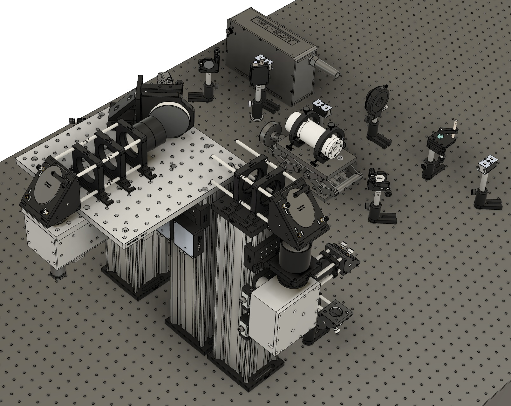

# Microscope
Design and documentation for the TWINKLE two photon microscope.

### Repository Layout
    .
    ├── cad                     # CAD files of the entire instrument in various Autodesk formats
    ├── documentation           # Built instructions / supplemental material
    ├── manuscript              # Latex code and figures for the main manuscript
    ├── parts                   # Detailed bill of materials, important quotes, and drawings for machining.
    ├── zemax                   # Optics Simulation
    |
    ├── LICENSE                 # Text file: This work is licensed under a CC Attribution 4.0 International License.
    ├── README.md               # Text file: This info file
    └── okh-manifest.yml        # Text file: Open Know-How manifest files   

### Source files
The CAD files are provided in two formats:
- The Fusion 360 native format as `FullAssembly.f3d`. md5 sum `441e758a93336d974f597775d977376b`.
- For Autodesk Inventor:
    1. When using the Inventor folder, open the master assembly `FullAssembly.iam`.
    2. A zip file of the same data is split into three files. Assemble the data with `cat x?? > FullAssembly.iam.zip`. The file `FullAssembly.iam.zip` should be around 160 MB with md5 hash `09c5af80a2e161584779715d610bf24a`.

### License
This work is free: you can redistribute it and/or modify it under the terms of the Creative Commons Attribution 4.0 International license, version 4 of the License, or (at your option) any later version (CC-BY-4.0). This program is distributed in the hope that it will be useful, but WITHOUT ANY WARRANTY, to the extent permitted by law; without even the implied warranty of MERCHANTABILITY or FITNESS FOR A PARTICULAR PURPOSE. A copy of the License is provided in this repository.  For more details, see <http://www.gnu.org/licenses/>.