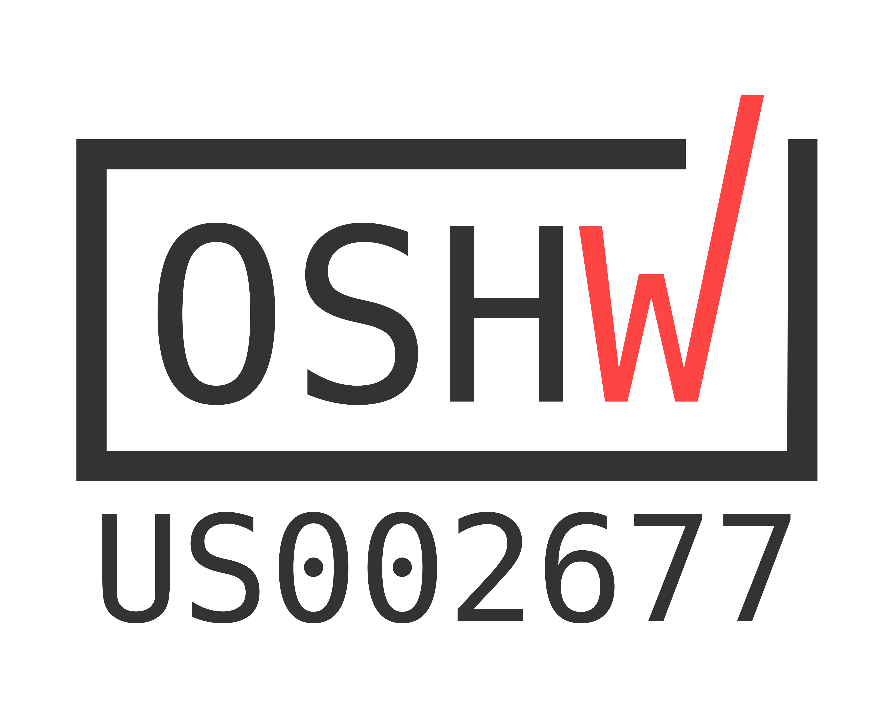
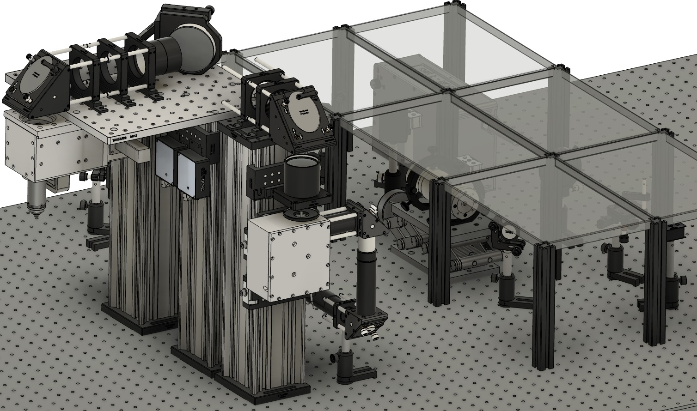

# Twinkle 

This repository documents a microscope for Two-photon Imaging in Neuroscience, and Kit for Learning and Education — "Twinkle".   It offers an affordable solution for a fully open, high-performance and cost-effective research and teaching microscope. Here, you can find the complete design and documentation. 

### Repository Content
    .
    ├── article                 # Latex code and figures for the main manuscript.
    ├── assets                  # Supporting files, OSHW certification.
    ├── cad                     # Computer-aided design (CAD) files of the entire instrument in various file formats.
    ├── documentation           # Build instructions and supplemental material.
    ├── parts                   # Detailed bill of materials (BoM), important quotes, and drawings for machining.
        ├── Drawings            # Drawings for machining.
        ├── various files       # BoM and important quotes.
    ├── zemax                   # Optics simulations.
        ├── Collection          # Zemax files, drawings, and simulated performance of the collection optics.
        ├── Excitation          # Zemax files, drawings, and simulated performance of the excitation optics.
        ├── matlab              # Matlab scripts, using the Zemax API, measuring the performance of the excitation system.
    ├── LICENSE                 # Text file: This work is licensed under a CC Attribution 4.0 International License.
    ├── README.md               # Text file: This info file.
    └── okh-manifest.yml        # Text file: Open Know-How manifest files.   

### Computer assisted design (CAD) files
The CAD files are provided in two formats:
- In the Fusion 360 native format as `FullAssembly.f3d`; md5 hash `cbc14d6bce3a4f311935500c3b959128`.
- For Autodesk Inventor:
    1. When using the Inventor folder, open the master assembly `FullAssembly.iam`.
    2. A zip file of the same data is split into three files. Assemble the data with `cat x?? > FullAssembly.zip`. The file `FullAssembly.zip` is 166 MB with md5 hash `130a4bcaa6f747f43ba337dc33d74409`.

### Issue
Issues are tracked through this repository. For minor updates, just push. For major ones, use a PR. 

### License
This work is free: you can redistribute it and/or modify it under the terms of the Creative Commons Attribution 4.0 International license, version 4 of the License, or (at your option) any later version (CC-BY-4.0). This program is distributed in the hope that it will be useful, but WITHOUT ANY WARRANTY, to the extent permitted by law; without even the implied warranty of MERCHANTABILITY or FITNESS FOR A PARTICULAR PURPOSE. A copy of the License is provided in this repository.  For more details, see <http://www.gnu.org/licenses/>.

